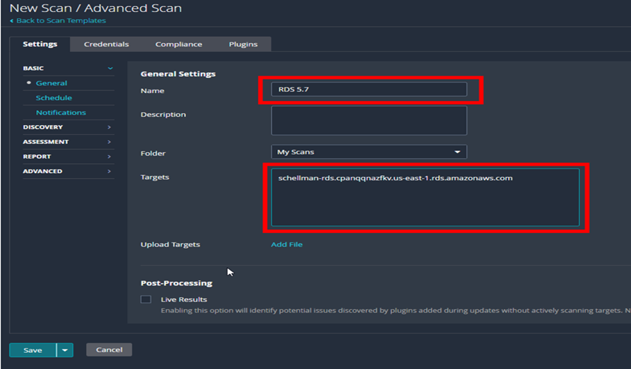

### Managed services Documentation for tenable to understand workflow to access and perform scanning ( RDS Database) 

-   **In this document we'll review how to configure a Nessus policy
    that will run successful scans using compliance benchmarks against
    an RDS database.**

**Scanning AWS RDS database with a Nessus Scanner tool-- 5 Steps**

**[1. Gather Credentials]**

**You'll need two pieces of information before you can get started with
the configuration:**

-   The RDS endpoint URL or IP address. Can be found in your AWS console under RDS -\> Databases -\> Database_name
-   The master database username/password
-   Can be found wherever you store your credential information (which hopefully is within a trusted password manager and not in an Excel sheet on your desktop)

**[2. Set Up “Advanced Scan”]**

When you have this information in hand, you can navigate to your Nessus
management page and begin configuring a new "Advanced Scan" policy.

First, make sure to edit the "General Setting" section and enter the name of the scan and the target (endpoint) that you gathered from RDS in AWS.

Next, you can start stripping out the "vulnerability" scan part of the policy. We're not setting up a discovery scan, so:

-   Under settings, go to "Discovery" -\> "Host Discovery."

-   DISABLE ping. 

As [penetration
testers](https://www.schellman.com/blog/cybersecurity/problems-penetration-testers-face) that
work extensively on FedRAMP projects, we know **this is a critical
step---skipping this setting is the number one issue we see with cloud
service providers (CSPs) and their scans. **RDS instances won't respond
to an ICMP ping even if a security group that allows it has been
attached to the instance. Because of this, Nessus will ping, then skip
over the host by default when it doesn't respond. 

**[3. Modify Port Scan Range]**

Next, navigate to the "Port Scanning" page right below "Host Discovery"
and modify the port scan range.

**Pull the default value of "default" and instead substitute whatever
port your database is running on. **Default values to change may
include:

-   3306 for MySQL

-   1433 for MSSQL

-   5432 for Postgres

-   1521 for Oracle

Remember, this isn't a vulnerability or discovery scan---it's a targeted
compliance scan, so there's no need to force Nessus to check another
several thousand ports that won't be open. 

**[4. Configure Scan Credentials and Benchmarks]**

 

After that:

-   Head to the "Credentials" tab.

-   Select Categories and choose "Database" from the drop-down
    selection.

-   Using the username and password you collected in Step 1, fill out
    all the current information of the database you will be scanning.

Then, under the "Compliance" tab, pick your benchmark. For the purposes
of this example, we'll be using the MySQL 5.7 L1, but any of the CIS or
STIG benchmarks will run against RDS hosts.

If you're unsure what benchmark to use, go back to RDS in AWS and locate
the version of your database you are using. Find this by navigating to
RDS-\>Database-\>Datasebase_Name-\>Configuration Tab-\>Engine Version.

**[5. Save and Scan]**

 

Once that's complete, you're done! You can save the policy and head over
to create a new scan, which is relatively simple---just pick your policy
and add your endpoint addresses before you can begin scanning away!

**Warning Designations**

**One last important note:** If you see a warning in the compliance scan
after it has been completed, click on the warning and read the
description.\
\
Should you see the below message, you're more than likely using the
wrong benchmark (i.e., using Community Edition instead of Enterprise or
the opposite).

